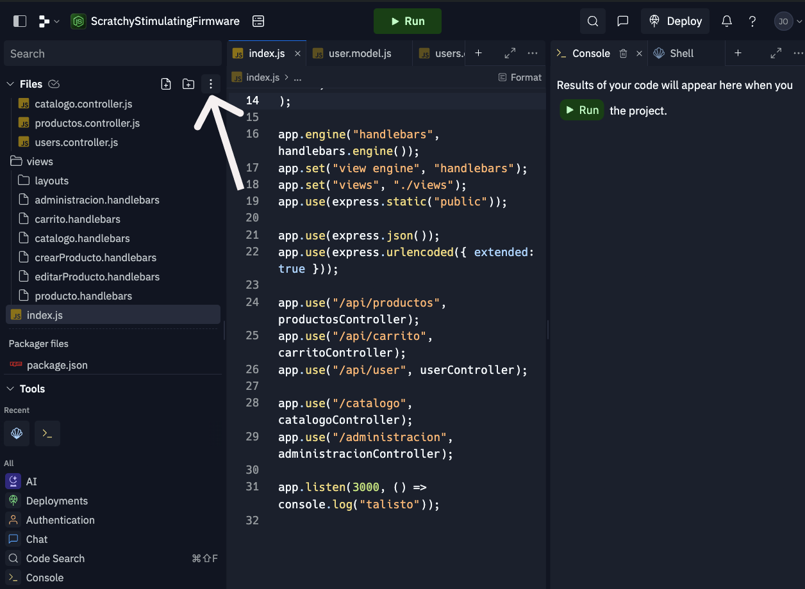
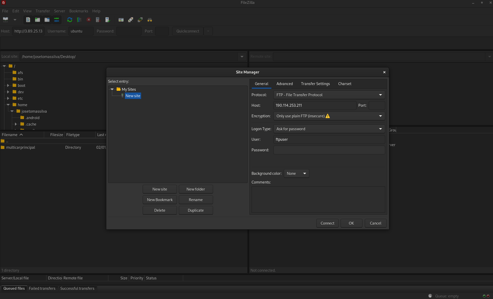
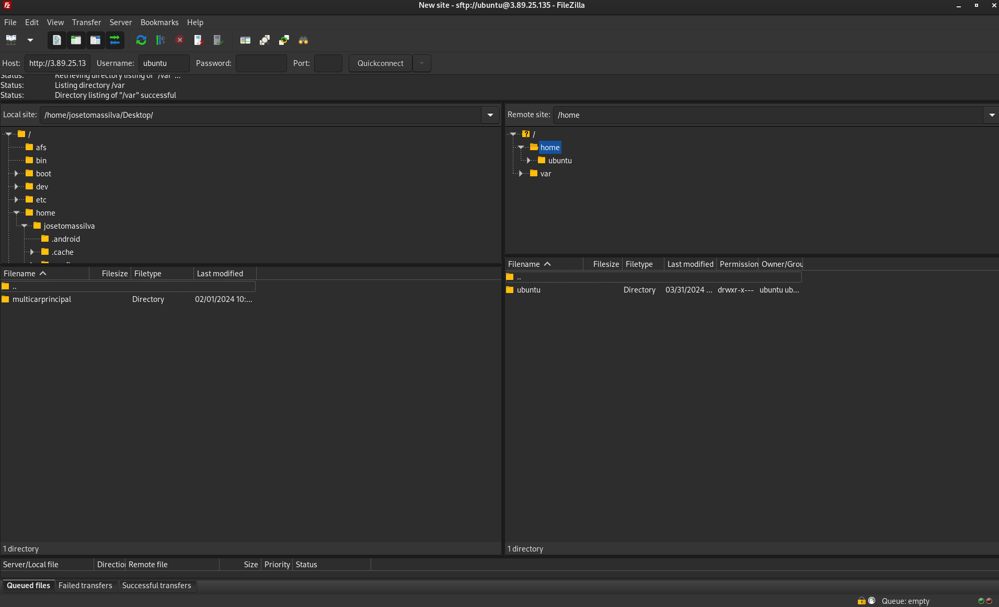

# Express en AWS (VPS)

_Última vez editado el 29 Mayo, 2024 por José Tomás Silva._

Para este ejemplo, se utilizará el código que se ha ido construyendo en cátedra, el cual pueden encontrar haciendo [click aquí](https://replit.com/@VadokDev/ScratchyStimulatingFirmware#index.js).
Además, se exporta el código desde Replit en formato .zip.
De igual manera, se sugiere seguir este ejemplo con tu propio proyecto de Express, para que puedas avanzar con tu entrega.

### ¿Cómo exportar el proyecto de Replit?

Dentro del proyecto de Replit, clickea en el botón con los 3 puntos, ubicado en la parte superior de los archivos de tu proyecto.



Clickea en “**Descargar como zip”**


Para el desarrollo del documento, se consideran las siguientes condiciones:

☁️ Tienes tu servidor de AWS previamente configurado con lo solicitado para la entrega 1
🔐 Tienes en tu posesión el archivo _.pem_ para poder ingresar al servidor a través de SSH.

## Paso 1 - Conectarnos al servidor

En primera instancia nos conectaremos al servidor para poder instalar los paquetes necesarios para correr nuestro proyecto de Express.

Para ello, hacemos lo siguiente:

```bash
ssh ubuntu@IPV4 -i path/to/your/pem.pem
```

---

## Paso 2 - Instalar los paquetes

### Paso 2.1 - Instalar Node

Node es necesario para poder iniciar nuestro proyecto de Express, dado que nos permite tener un entorno de ejecución de Javascript en nuestro servidor.

En primera instancia, actualicemos los repositorios

```bash
sudo apt update
```

Luego, instalemos node

```bash
sudo apt install nodejs
```

Verificamos que la instalación ha sido exitosa solicitando la versión de node instalada:

```bash
node -v
```

### Paso 2.2 - Instalar npm

NPM nos permitirá gestionar, instalar y utilizar paquetes de Node, para ello, debemos instalarlo

```bash
sudo apt install npm
```

### Paso 2.3 - Instalar pm2

PM2 es una herramienta que nos permitirá:

1. 💥 Reiniciar nuestra aplicación en caso de que “crashee”
2. ♻️ Iniciar nuestra aplicación de NodeJS automáticamente cuando el servidor se reinicie

Para instalarla:

```bash
sudo npm install pm2 -g
```

---

## Paso 3 - Transferir nuestro proyecto al servidor

Para correr nuestro proyecto de Express en nuestro servidor, debemos traerlo hacia este.
Como vimos en la guía anterior, hay dos formas de hacerlo:

1. A través de un cliente visual, como FileZilla
2. A través de la terminal, usando SCP

<aside>
💡 A diferencia de la entrega anterior, no requerimos que nuestro proyecto se encuentre en `/var/www/html` , por lo que lo almacenaremos en el root de nuestro usuario.

</aside>

**Filezilla**

[Descargar Filezilla](https://filezilla-project.org/download.php?type=client)

Filezilla es un cliente de código abierto que soporta transferencias de archivos a través de FTP, FTPS y SFTP.

Una vez descargado FileZilla, dirígete a la esquina superior izquierda, y clickea en “File” o “Archivo” > “Site Manager” o “Gestor de Sitios”



Los campos deben verse de la siguiente forma:

- Protocol: SFTP
- Host / Servidor - Port / Puerto: la.ip.de.tu.instancia - 22
- Logon Type / Modo acceso: Key file / Archivo de claves
- User / Usuario: ubuntu
- Key file / Archivo de claves: selecciona tu .pem

Una vez dentro, en la parte derecha de la pantalla podrás ver los archivos de tu instancia



Arrastraremos nuestro proyecto hacia el root de nuestro servidor, es decir, `/` .

Eso es todo! Ya tenemos nuestros archivos en nuestro servidor. A continuación se detallará cómo realizar el mismo proceso pero a través de SCP.

**SCP (Secure Copy)**

SCP Nos permitirá transferir archivos hacia nuestro servidor sin una interfaz visual. Para ello, utilizaremos el siguiente comando:

```bash
scp -i /path/to/pem-key.pem path/to/file ubuntu@ip_of_your_instance:.
```

Desglosemos el script:

- -i /path/to/pem-key.pem : -i refiere a _identity file,_ nos permite agregar un archivo de identificación, en este caso, nuestro .pem
- /path/to/file : refiere a donde se encuentra en nuestra máquina el archivo que queremos enviar al servidor.

    <aside>
    💡 En caso de que quieras transferir una carpeta, la cual contiene muchos archivos, es muy probable que prefieras mandar un archivo .zip, y descomprimirlo en el servidor.
    Para ello, puedes comprimirlo a través de la GUI de tu sistema operativo, o bien utilizar el comando de linux:
    **Asumiendo que tu carpeta se llama project, y quieres guardarla en project.zip**
    
    </aside>
    
    ```bash
    zip -r project.zip project
    ```

- ubuntu@ip_of_your_instance:/var/www/html/: La parte **“ubuntu@ip_of_your_instance”** refiere al usuario de tu instancia, junto a su IP.
  Mientras que **: “.”** Refiere a dónde debe quedar alojado el archivo que vas a enviar.

<aside>
💡 En caso de que hayas enviado un .zip al servidor, tendrás que ingresar a él a través de SSH, y descomprimir el archivo utilizando:

</aside>

```bash
unzip project.zip .
```

---

## Paso 4 - Correr nuestro proyecto de Express

Ya que tenemos nuestro proyecto de express en nuestro servidor, debemos instalar todas sus dependencias y ejecutarlo con `PM2`.

Considerando que estamos en el root de nuestro servidor (es decir, no estamos dentro de ninguna carpeta), debemos tener una carpeta con el nombre `project`, el cual contiene nuestro proyecto de Express.

### Paso 4.1 - Instalación de dependencias

Ingresamos a la carpeta:

```bash
cd project
```

Una vez dentro de ella, podemos asegurarnos que estamos en nuestro proyecto ejecutando lo siguiente

```bash
ls
```

Que nos debe entregar algo similar a esto

```bash
index.js  models  node_modules  package-lock.json  package.json  public  routes  views
```

Si efectivamente nos encontramos dentro de nuestro proyecto de Express, instalamos sus dependencias

```bash
npm install
```

### Paso 4.2 - Ejecutar nuestro proyecto con pm2

Asumiendo que nuestro archivo principal es `index.js`:

```bash
pm2 start index.js
```

### Paso 4.3 - Configurar pm2 para resiliencia

Para permitir que pm2 ejecute nuevamente nuestro proyecto en caso de que nuestro servidor se reinicie, o nuestra app crashee, hacemos lo siguiente:

```bash
pm2 startup
```

Al ejecutar el comando anterior, pm2 logeará algo similar a esto:

```bash
[PM2] Init System found: systemd
[PM2] To setup the Startup Script, copy/paste the following command:
sudo env PATH=$PATH:/usr/bin /usr/local/lib/node_modules/pm2/bin/pm2 startup systemd -u ubuntu --hp /home/ubuntu
```

Copiamos el comando en nuestra consola y lo ejecutamos:

```bash
sudo env PATH=$PATH:/usr/bin /usr/local/lib/node_modules/pm2/bin/pm2 startup systemd -u ubuntu --hp /home/ubuntu
```

Luego, ejecutamos:

```bash
pm2 save
```

---

## Paso 5 - Proxy

Estamos cassssi listos.

Hasta este momento, nuestra app está corriendo en el puerto que le especificamos en nuestro `index.js` .

Pero de forma general, nadie accede a `facebook.com:3000`, ¿verdad?

Es por esto, que necesitamos hacer un **Proxy** con Apache.

### ¿Qué es un proxy?

Un proxy es un intermediario que se interpone entre los usuarios y tu app.
En este caso, apache recibirá las solicitudes que lleguen hacia tu IP, y las pasará al puerto 3000 de tu servidor, que es donde la aplicación de Express está corriendo.
De esta forma, la gente sólo tiene que acceder a al IP del servidor, y no a la IP junto al puerto.

Siguiendo el ejemplo de arriba:

**💀 Sin proxy**: `facebook.com:3000`

**🌈 Con proxy:** `facebook.com`

### Paso 5.1 - Habilitar módulos de proxy en Apache

Asegurémonos de que apache tiene los módulos de proxy habilitados. Para ello, ejecuta lo siguiente:

```bash
sudo a2enmod proxy
sudo a2enmod proxy_http
```

### Paso 5.2 - Editar la configuración del sitio de Apache

Ahora, vamos a decirle a Apache que todo el tráfico HTTP vaya a nuestra app Express. Edita el archivo de configuración del sitio (esto es asumiendo que estás usando el archivo por defecto de configuración, en cualquier otro caso, edita el que hayas creado tu).

```bash
sudo nano /etc/apache2/sites-available/000-default.conf

```

Dentro del archivo, agrega las líneas del proxy

```bash
<VirtualHost *:80>
    ServerAdmin webmaster@localhost

    ProxyPass "/" "http://localhost:3000/"
    ProxyPassReverse "/" "http://localhost:3000/"

    ErrorLog ${APACHE_LOG_DIR}/error.log
    CustomLog ${APACHE_LOG_DIR}/access.log combined
</VirtualHost>

```

### Paso 5.3 - Verificar y reiniciar Apache

Nos aseguramos que todo esté bien configurado

```bash
sudo apachectl configtest
```

Luego, reiniciamos Apache

```bash
sudo systemctl restart apache2
```

---

## 🎉 ¡Listo!

Tu app de express ya está funcionando en la web.
